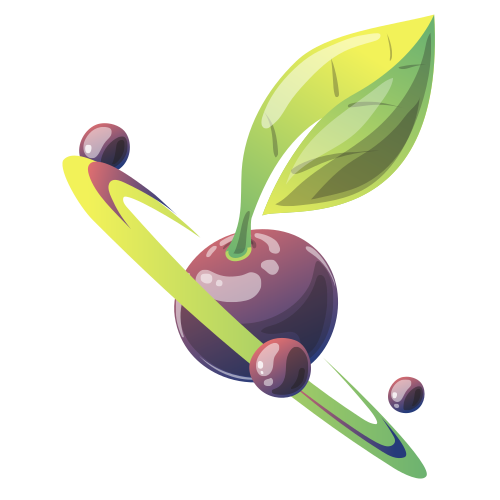
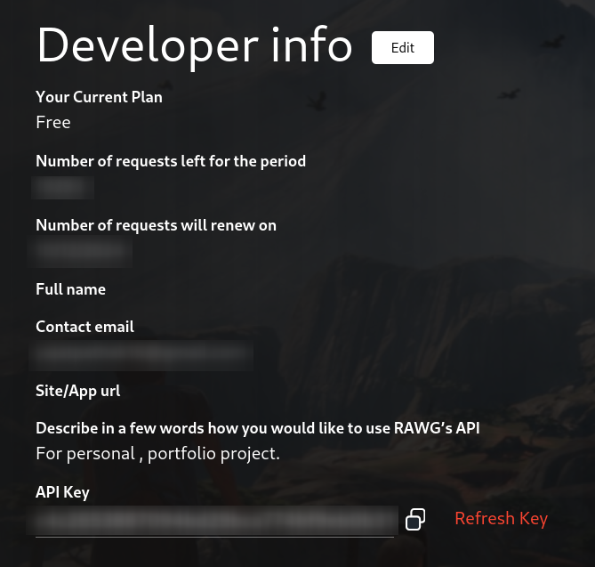
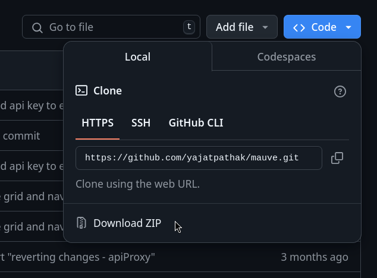
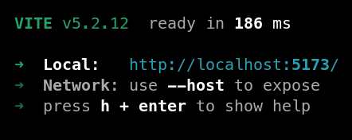
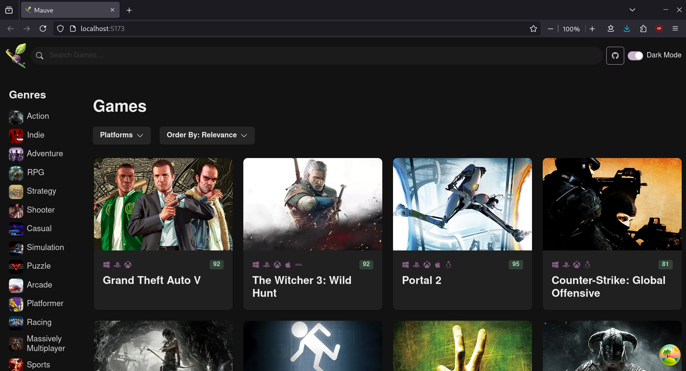

# Mauve

## A Video Game Surfing Application / Library Built with React and RAWG.io API

> **Author:** Yajat Pathak <br /> >**Live Preview:** [Mauve Live](https://mauve-seven.vercel.app/) <br /> >**GitHub Repository:** [Mauve GitHub](https://github.com/yajatpathak/mauve) <br />

Mauve is a video game library application that allows users to filter and search for video games. It provides comprehensive details about each game, including links to their store pages for downloading. This project serves as a React-based learning experience, focusing on front-end development.

---

### Technologies Used

- **API Integration:** [RAWG.io](https://rawg.io/apidocs) for fetching game data.
- **UI Styling:** [Chakra UI](https://v2.chakra-ui.com/)
- **Routing:** [React Router](https://reactrouter.com/en/main)
- **State Management:**
  - Query caching and async state with [TanStack Query](https://tanstack.com/query/latest)
  - Local state management with [Zustand](https://zustand.docs.pmnd.rs/getting-started/introduction)
- **HTTP Requests:** [Axios](https://axios-http.com/)
- **Icons:** [React Icons](https://react-icons.github.io/react-icons/)

---

### Running the Project

> #### Prerequisites
>
> - Install [Node.js](https://nodejs.org/en/download/prebuilt-installer)
> - Create a [RAWG.io](https://rawg.io/signup) Developer Account to obtain an API key.

#### Setup Instructions

1. **Install Node.js:**

   - Download and install Node.js. Ensure it is added to your system PATH.
   - Verify installation by running `node --version` in the terminal.

2. **Obtain RAWG.io API Key:**

   - Create a developer account on RAWG.io.
   - Copy your API key from the RAWG.io dashboard. Keep it safe.

   

3. **Clone the Repository or Download the Code:**

   - If you have Git installed, clone the repository with:
     ```bash
     git clone https://github.com/yajatpathak/mauve.git
     ```
   - Alternatively, download the ZIP file from GitHub and extract it to your preferred location.

   

4. **Set Up Environment Variables:**

   - Create a `.env.local` file in the source directory.
   - Add the following line, replacing `YOUR_API_KEY` with your RAWG.io API key:
     ```plaintext
     VITE_RAWG_API_KEY="YOUR_API_KEY"
     ```

5. **Install Dependencies:**

   - Navigate to the project directory in your terminal.
   - Run the following command to install required Node.js modules:
     ```bash
     npm install
     ```

6. **Run the Project Locally:**

   - Start the development server with:
     ```bash
     npm run dev
     ```
   - Open the provided localhost link in your web browser to view the application.

   
   

---

### Future Scope

While the project is complete, future updates will include comprehensive documentation.

---
